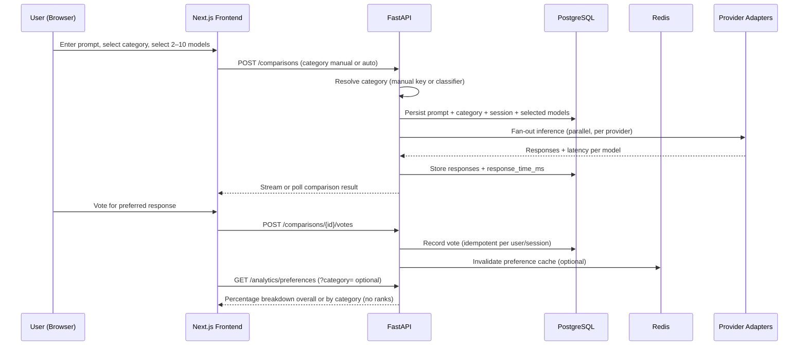

# Arab Benchmark AI — System Architecture

## 1. Vision & Design Principles

Arab Benchmark AI is an Arabic-first web platform where users submit one prompt, select 2–10 AI models, compare responses side-by-side, and vote for their preferred answer. The platform surfaces **community preferences** (percentages only)—never official rankings, winners, or losers.

| Principle | Implication |
|-----------|-------------|
| **Arabic-first** | RTL layout, Arabic copy, Arabic prompt handling, and locale-aware analytics are first-class—not retrofits. |
| **Provider-based** | Each model family (GPT, Claude, Gemini, etc.) is isolated behind a provider adapter; adding a model is additive. |
| **Startup speed** | Monorepo, managed Postgres, serverless-friendly frontend, minimal services at launch. |
| **Honest UX** | No leaderboard language; statistics are framed as "community preference share." |
| **Agent-ready** | Core abstractions (`InferenceTarget`, `ComparisonSession`) are model-agnostic so agents plug in later without schema rewrites. |
| **Category-scoped analytics** | Every comparison belongs to exactly one prompt category; preferences are aggregated globally and per category. |

---

## 2. High-Level Architecture

```
┌─────────────────────────────────────────────────────────────────────────┐
│                         CLIENT (Next.js + TypeScript)                   │
│  Arabic RTL UI · Category picker · Model picker (2–10) · Comparison · Voting · Stats │
└───────────────────────────────────┬─────────────────────────────────────┘
                                    │ HTTPS / JSON
                                    ▼
┌─────────────────────────────────────────────────────────────────────────┐
│                      API GATEWAY LAYER (FastAPI)                        │
│  Auth · Rate limits · Validation · Orchestration · Analytics queries    │
└───────┬─────────────────┬──────────────────────┬────────────────────────┘
        │                 │                      │
        ▼                 ▼                      ▼
┌──────────────┐  ┌──────────────┐      ┌──────────────────┐
│  PostgreSQL  │  │    Redis     │      │  Provider Layer  │
│  (primary)   │  │  (cache/queue)│      │  (adapters)      │
└──────────────┘  └──────────────┘      └────────┬─────────┘
                                                  │
                    ┌─────────────────────────────┼─────────────────────────┐
                    ▼         ▼         ▼         ▼         ▼         ▼     ▼
                  OpenAI   Anthropic  Google   DeepSeek   Qwen    xAI   ALLaM
                  (GPT)    (Claude)  (Gemini)                        (Grok) (stub)
```

### Request lifecycle (comparison flow)



---

## 3. Component Breakdown

### 3.1 Frontend (Next.js + TypeScript + TailwindCSS)

**Responsibilities**
- Arabic-first UI with RTL as default (`dir="rtl"`, logical CSS properties).
- Prompt input with Arabic text support (Unicode normalization on client for display consistency).
- **Category selector**: required before submit; manual pick from 8 fixed categories or "auto-detect" toggle.
- Dynamic model selector: enforce 2–10 models, group by provider, show availability badges.
- Side-by-side or stacked comparison layout (responsive).
- Voting UI: single selection per comparison; no "winner" copy.
- Preference analytics: bar charts / percentages with disclaimers.
- Optimistic UI for votes; SSE or polling for in-flight comparisons.

**Key modules**
| Module | Purpose |
|--------|---------|
| `i18n` | Arabic strings; English optional later |
| `comparison` | Session state, category selection, model selection, result rendering |
| `categories` | List categories, auto-detect preview, manual override UX |
| `voting` | Vote submission, duplicate prevention UX |
| `analytics` | Fetch and render overall + per-category preference percentages |
| `api-client` | Typed client generated from OpenAPI spec |

**Deployment**: Vercel or equivalent CDN edge; environment variables for API base URL only.

### 3.2 API Layer (FastAPI + Python)

**Responsibilities**
- REST API with OpenAPI documentation (source of truth for frontend types).
- Comparison orchestration: validate model count (2–10), **require category**, fan-out to providers in parallel.
- **Category resolution**: accept manual `category_key` or run auto-detection when `category_mode: auto`.
- Vote ingestion with idempotency (one vote per user per comparison).
- Analytics aggregation queries (percentages, filters by model, time range, **prompt category**).
- Rate limiting and abuse prevention.
- Provider health checks and circuit breaking.

**Structural layout** (conceptual, not implementation)
```
app/
  api/          # Route handlers
  core/         # Config, security, dependencies
  domain/       # Business rules (vote rules, model limits)
  providers/    # One adapter per vendor
  services/     # Comparison orchestrator, analytics service, category classifier
  repositories/ # DB access
```

### 3.3 Prompt Categories

Every comparison is assigned **exactly one** category at creation time. Categories are a fixed, seeded catalog—not user-defined tags.

| Key | English | Arabic (UI) |
|-----|---------|-------------|
| `business` | Business | أعمال |
| `startup` | Startup | شركات ناشئة |
| `coding` | Coding | برمجة |
| `research` | Research | بحث |
| `marketing` | Marketing | تسويق |
| `arabic_writing` | Arabic Writing | كتابة عربية |
| `legal` | Legal | قانوني |
| `general` | General | عام |

**Assignment modes**

| Mode | Flow |
|------|------|
| **Manual** | User selects category in UI; API stores `category_source: manual`. |
| **Auto-detect** | User enables auto-detect; API runs classifier on prompt text before inference; stores `category_source: auto` plus `category_confidence` (0–1). |

**Auto-detection (MVP approach — startup speed)**

1. **Phase 1**: Lightweight classifier via a single fast LLM call (e.g., GPT-4o-mini) with a constrained JSON output schema mapping to the 8 keys. Fallback to `general` on low confidence (&lt; 0.6) or classifier failure.
2. **Phase 2+**: Optional fine-tuned Arabic classifier or rules layer for cost reduction; same API contract.

**UX rules**
- User may override auto-detected category before submitting the comparison.
- Resolved category is shown on comparison results and included in analytics filters.
- Auto-detect preview endpoint (`POST /categories/detect`) lets the UI suggest a category without creating a comparison.

**Analytics impact**
- Votes inherit category through `comparisons.category_id` (denormalized join path).
- Rollups keyed by `(model_id, category_id, period)` for per-category preference shares.
- Overall preferences = aggregate across all categories (no category filter).

### 3.4 Provider Layer (Adapter Pattern)

Each supported model maps to a **provider adapter** implementing a common contract:

| Method | Description |
|--------|-------------|
| `complete(prompt, model_id, options)` | Returns text + `response_time_ms` + token usage (optional) |
| `list_models()` | Returns enabled models for this provider |
| `health_check()` | Lightweight ping for status dashboard |

**Initial providers**

| Provider key | Vendor API | Models (examples) | Launch status |
|--------------|------------|-------------------|---------------|
| `openai` | OpenAI | GPT-4o, GPT-4o-mini | MVP |
| `anthropic` | Anthropic | Claude 3.5 Sonnet, Haiku | MVP |
| `google` | Google AI | Gemini 1.5 Pro, Flash | MVP |
| `deepseek` | DeepSeek | DeepSeek Chat | MVP |
| `qwen` | Alibaba DashScope | Qwen Turbo, Plus | Phase 2 |
| `xai` | xAI | Grok | Phase 2 |
| `allam` | TBD (Saudi) | ALLaM | Stub → integrate when API available |

**ALLaM placeholder**: Adapter returns a structured "unavailable" response until credentials and API contract are confirmed; UI shows "قريباً" (coming soon) without breaking comparison flows for other models.

**Adding a model** = config row + optional adapter tweak; **no** core orchestration changes.

### 3.5 Data Layer (PostgreSQL)

- Primary store for prompts, comparisons, categories, responses, votes, models, users.
- Materialized views or nightly rollups for analytics at scale (Phase 2).
- See `DATABASE_SCHEMA.md` for full schema.

### 3.6 Cache & Queue (Redis) — Phase 1.5+

Introduce when parallel inference or analytics load warrants it:

| Use case | Pattern |
|----------|---------|
| Comparison in progress | Short-TTL key per `comparison_id` |
| Analytics hot queries | Cache preference percentages overall + per category (60–300s TTL) |
| Rate limiting | Token bucket per IP / user |
| Background jobs | Celery or ARQ for long comparisons (Phase 2) |

**MVP**: In-process `asyncio.gather` for fan-out; Redis optional until traffic grows.

---

## 4. Arabic-First Considerations

| Area | Approach |
|------|----------|
| **UI** | RTL default; Tailwind logical properties (`ms-`, `me-`, `text-start`). |
| **Typography** | Web font stack optimized for Arabic (e.g., IBM Plex Sans Arabic, Noto Sans Arabic). |
| **Prompt handling** | Store raw UTF-8; optional NFC normalization before provider calls for consistency. |
| **Analytics copy** | "نسبة تفضيل المجتمع" not "الأفضل" or "الفائز". |
| **Search/filter** | PostgreSQL `pg_trgm` or `unaccent` extension for Arabic prompt search (Phase 2). |
| **Locale** | `ar-SA` as default locale; timestamps in user's timezone with Arabic month names via `Intl`. |

---

## 5. Security & Identity

### MVP (fastest path)
- **Anonymous sessions** via signed cookie or device fingerprint hash for vote deduplication.
- Optional lightweight auth (magic link or OAuth) in Phase 2 for persistent history.

### Production hardening
- API keys for providers stored in secrets manager (never in repo).
- Input sanitization; max prompt length (e.g., 4,000 chars MVP).
- Rate limits: comparisons per IP/hour, votes per session.
- CORS locked to frontend origin.
- Audit log for admin actions (model enable/disable).

---

## 6. Scalability Strategy

### Horizontal scaling
| Tier | Scale trigger | Action |
|------|---------------|--------|
| **0–1K DAU** | Launch | Single FastAPI instance + managed Postgres |
| **1K–10K DAU** | p95 latency ↑ | 2–3 API replicas behind load balancer; Redis cache |
| **10K+ DAU** | DB CPU ↑ | Read replica for analytics; connection pooling (PgBouncer) |
| **50K+ DAU** | Inference cost ↑ | Dedicated worker pool; optional user-tier rate limits |

### Inference fan-out
- Comparisons with up to 10 models run **in parallel** per request.
- Per-provider concurrency limits and timeouts (e.g., 30s default, configurable per model).
- Partial success: return available responses; mark failed models with error state (no retry storm in MVP).

### Analytics
- MVP: real-time SQL aggregates (acceptable &lt; 100K votes); filter by `category_id` or omit for overall.
- Scale: pre-aggregated `preference_rollups` table keyed by `(model_id, category_id, period)` updated on vote insert (trigger or async job).
- Cache keys include category scope: `prefs:all_time` vs `prefs:all_time:category:coding`.

---

## 7. Observability

| Signal | Tool (suggested) |
|--------|------------------|
| Logs | Structured JSON (request_id, comparison_id, provider, latency) |
| Metrics | Prometheus: inference latency, error rate per provider, votes/min |
| Traces | OpenTelemetry across API → provider calls |
| Alerts | Provider error rate &gt; 5% for 5 min; DB connection exhaustion |

---

## 8. Future: AI Agents Support

Design hooks now to avoid rework:

| Concept | Model today | Agent tomorrow |
|---------|-------------|----------------|
| `InferenceTarget` | `type=model`, `ref=model_id` | `type=agent`, `ref=agent_id` |
| Comparison session | N model responses | N agent trajectories (multi-step) |
| Vote unit | Single text response | Final answer or full trace (user choice TBD) |
| Storage | `responses.content` TEXT | `responses.content` JSONB (steps, tool calls) |

**Agent adapter** extends provider contract with `run_agent(prompt, agent_config)` returning structured trace. Voting and analytics layers remain unchanged—they operate on `response_id`, not content shape.

---

## 9. Deployment Topology (MVP)

```
┌─────────────┐     ┌─────────────┐     ┌─────────────────┐
│   Vercel    │────▶│  Railway /  │────▶│  Neon / Supabase│
│  (Next.js)  │     │  Fly.io API │     │  (PostgreSQL)   │
└─────────────┘     └─────────────┘     └─────────────────┘
                           │
                           ▼
                    Vendor APIs (HTTPS)
```

- **CI/CD**: GitHub Actions — lint, test, deploy on `main`.
- **Environments**: `dev`, `staging`, `prod` with separate DB and API keys.
- **IaC**: Defer Terraform until second environment; use platform dashboards for MVP.

---

## 10. Non-Goals (MVP)

- Official benchmark claims or academic leaderboard.
- Automated Arabic quality scoring (human preference only).
- Fine-tuning or training pipelines.
- Multi-turn chat comparisons (single-turn prompt only at launch).
- Mobile native apps (responsive web only).

---

## 11. Key Risks & Mitigations

| Risk | Mitigation |
|------|------------|
| Provider API outage | Circuit breaker; partial results; status page per provider |
| Vote manipulation | Session fingerprint + rate limits; optional auth later |
| Cost explosion (10 models × traffic) | Per-IP limits; default to 3–4 models in UI; monitor spend alerts |
| ALLaM API unavailable | Stub adapter; feature flag |
| Arabic text edge cases | Store raw bytes; test with diverse dialect samples |
| Category misclassification | User override before submit; store `category_source` + confidence for audit; default to `general` on failure |

---

## 12. Document Index

| Document | Scope |
|----------|-------|
| `DATABASE_SCHEMA.md` | Tables, indexes, relationships |
| `API_SPEC.md` | REST endpoints, payloads, errors |
| `ROADMAP.md` | Phased delivery plan |
| `PROJECT_CONTEXT.md` | Product source of truth |
