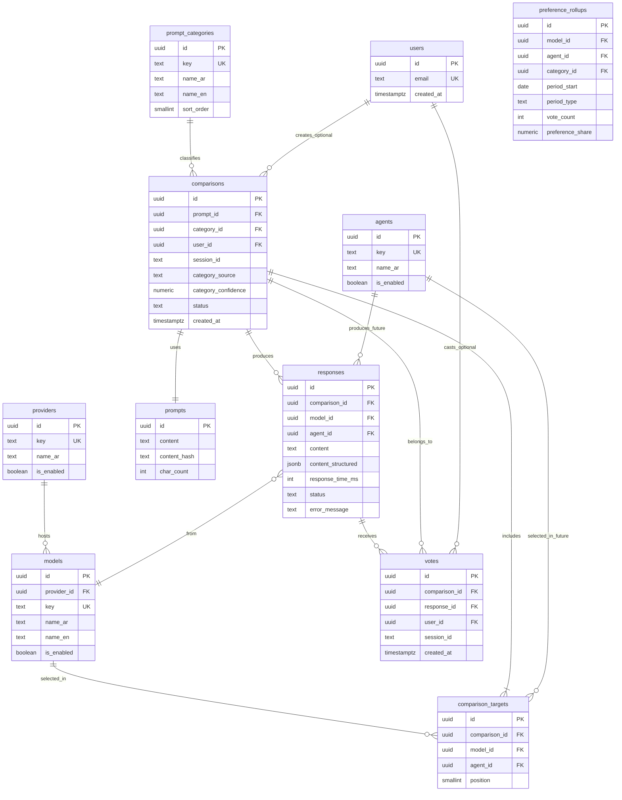

# Arab Benchmark AI — Database Schema

PostgreSQL 15+ is the system of record. All timestamps are `TIMESTAMPTZ` (UTC). Primary keys are UUID v4 unless noted.

**Design goals**
- Normalize votes and responses for integrity and analytics.
- Support 2–10 targets per comparison (models today; agents later).
- Enable percentage aggregation without winner/loser semantics.
- Require every comparison to belong to exactly one prompt category.
- Support overall and per-category preference analytics.
- Minimize migrations when adding providers or agents.

---

## 1. Entity Relationship Overview



---

## 2. Core Tables

### 2.1 `providers`

Vendor-level grouping (OpenAI, Anthropic, Google, etc.).

| Column | Type | Constraints | Description |
|--------|------|-------------|-------------|
| `id` | `UUID` | PK, default `gen_random_uuid()` | |
| `key` | `VARCHAR(32)` | UNIQUE, NOT NULL | Stable slug: `openai`, `anthropic`, `google`, `deepseek`, `qwen`, `xai`, `allam` |
| `name_ar` | `VARCHAR(128)` | NOT NULL | Arabic display name |
| `name_en` | `VARCHAR(128)` | | English display name (optional) |
| `is_enabled` | `BOOLEAN` | NOT NULL, default `true` | Global kill switch |
| `config` | `JSONB` | default `{}` | Non-secret metadata (base URL overrides) |
| `created_at` | `TIMESTAMPTZ` | NOT NULL, default `now()` | |
| `updated_at` | `TIMESTAMPTZ` | NOT NULL, default `now()` | |

**Seed data (initial)**

| key | name_ar |
|-----|---------|
| `openai` | OpenAI |
| `anthropic` | Anthropic |
| `google` | Google |
| `deepseek` | DeepSeek |
| `qwen` | Qwen |
| `xai` | xAI |
| `allam` | علّام |

---

### 2.2 `models`

Individual inference endpoints (GPT-4o, Claude 3.5 Sonnet, etc.).

| Column | Type | Constraints | Description |
|--------|------|-------------|-------------|
| `id` | `UUID` | PK | |
| `provider_id` | `UUID` | FK → `providers.id`, NOT NULL | |
| `key` | `VARCHAR(64)` | UNIQUE, NOT NULL | e.g. `gpt-4o`, `claude-3-5-sonnet` |
| `name_ar` | `VARCHAR(128)` | NOT NULL | Arabic UI label |
| `name_en` | `VARCHAR(128)` | | |
| `is_enabled` | `BOOLEAN` | NOT NULL, default `true` | |
| `is_placeholder` | `BOOLEAN` | NOT NULL, default `false` | `true` for ALLaM until API live |
| `sort_order` | `SMALLINT` | NOT NULL, default `0` | Picker ordering |
| `max_tokens` | `INTEGER` | default `4096` | Per-model cap |
| `timeout_ms` | `INTEGER` | default `30000` | |
| `created_at` | `TIMESTAMPTZ` | NOT NULL, default `now()` | |
| `updated_at` | `TIMESTAMPTZ` | NOT NULL, default `now()` | |

**Indexes**
- `idx_models_provider_enabled` ON (`provider_id`, `is_enabled`) WHERE `is_enabled = true`

**Constraint**
- Placeholder models (`is_placeholder = true`) must not be selectable in comparisons (enforced at API layer; optional DB check via application logic).

---

### 2.3 `prompts`

Deduplicated prompt storage for analytics reuse.

| Column | Type | Constraints | Description |
|--------|------|-------------|-------------|
| `id` | `UUID` | PK | |
| `content` | `TEXT` | NOT NULL | Raw UTF-8 Arabic (or mixed) text |
| `content_hash` | `CHAR(64)` | NOT NULL | SHA-256 of normalized content |
| `char_count` | `INTEGER` | NOT NULL | |
| `created_at` | `TIMESTAMPTZ` | NOT NULL, default `now()` | |

**Indexes**
- `idx_prompts_content_hash` ON (`content_hash`)

**Note**: Prompts are content-addressed; identical prompts share one row across comparisons.

---

### 2.4 `prompt_categories`

Fixed catalog of prompt categories. Seeded at migration time; not user-editable in MVP.

| Column | Type | Constraints | Description |
|--------|------|-------------|-------------|
| `id` | `UUID` | PK, default `gen_random_uuid()` | |
| `key` | `VARCHAR(32)` | UNIQUE, NOT NULL | Stable slug (see seed data) |
| `name_ar` | `VARCHAR(128)` | NOT NULL | Arabic UI label |
| `name_en` | `VARCHAR(128)` | NOT NULL | English label |
| `sort_order` | `SMALLINT` | NOT NULL, default `0` | Picker ordering |
| `is_enabled` | `BOOLEAN` | NOT NULL, default `true` | |
| `created_at` | `TIMESTAMPTZ` | NOT NULL, default `now()` | |

**Seed data**

| key | name_en | name_ar | sort_order |
|-----|---------|---------|------------|
| `business` | Business | أعمال | 1 |
| `startup` | Startup | شركات ناشئة | 2 |
| `coding` | Coding | برمجة | 3 |
| `research` | Research | بحث | 4 |
| `marketing` | Marketing | تسويق | 5 |
| `arabic_writing` | Arabic Writing | كتابة عربية | 6 |
| `legal` | Legal | قانوني | 7 |
| `general` | General | عام | 8 |

**Indexes**
- `idx_prompt_categories_key` ON (`key`)
- `idx_prompt_categories_enabled` ON (`sort_order`) WHERE `is_enabled = true`

---

### 2.5 `users` (Phase 2+; table created in MVP for forward compatibility)

| Column | Type | Constraints | Description |
|--------|------|-------------|-------------|
| `id` | `UUID` | PK | |
| `email` | `VARCHAR(255)` | UNIQUE | Nullable for anonymous era |
| `display_name` | `VARCHAR(128)` | | |
| `created_at` | `TIMESTAMPTZ` | NOT NULL, default `now()` | |

---

### 2.6 `comparisons`

A single user session comparing one prompt across N models. **Every comparison must have exactly one category.**

| Column | Type | Constraints | Description |
|--------|------|-------------|-------------|
| `id` | `UUID` | PK | |
| `prompt_id` | `UUID` | FK → `prompts.id`, NOT NULL | |
| `category_id` | `UUID` | FK → `prompt_categories.id`, NOT NULL | Resolved category |
| `category_source` | `VARCHAR(10)` | NOT NULL | `manual` or `auto` |
| `category_confidence` | `NUMERIC(4,3)` | NULL | 0.000–1.000; set when `category_source = auto` |
| `user_id` | `UUID` | FK → `users.id`, NULL | Optional authenticated user |
| `session_id` | `VARCHAR(64)` | NOT NULL | Anonymous session fingerprint |
| `status` | `VARCHAR(20)` | NOT NULL | `pending`, `running`, `completed`, `partial`, `failed` |
| `target_count` | `SMALLINT` | NOT NULL | 2–10, denormalized for validation audits |
| `created_at` | `TIMESTAMPTZ` | NOT NULL, default `now()` | |
| `completed_at` | `TIMESTAMPTZ` | | When all targets finished or timed out |

**Indexes**
- `idx_comparisons_session_created` ON (`session_id`, `created_at` DESC)
- `idx_comparisons_status` ON (`status`) WHERE `status` IN (`pending`, `running`)
- `idx_comparisons_category_created` ON (`category_id`, `created_at` DESC)

**Check constraint**
- `target_count BETWEEN 2 AND 10`

---

### 2.7 `comparison_targets`

Join table: which models (or agents) were selected for a comparison.

| Column | Type | Constraints | Description |
|--------|------|-------------|-------------|
| `id` | `UUID` | PK | |
| `comparison_id` | `UUID` | FK → `comparisons.id` ON DELETE CASCADE, NOT NULL | |
| `model_id` | `UUID` | FK → `models.id`, NULL | Set for model targets |
| `agent_id` | `UUID` | FK → `agents.id`, NULL | Set for agent targets (Phase 5) |
| `position` | `SMALLINT` | NOT NULL | Display order (0-based) |

**Constraints**
- Exactly one of `model_id` or `agent_id` must be non-null (CHECK).
- UNIQUE (`comparison_id`, `model_id`) WHERE `model_id IS NOT NULL`
- UNIQUE (`comparison_id`, `agent_id`) WHERE `agent_id IS NOT NULL`

**Indexes**
- `idx_comparison_targets_comparison` ON (`comparison_id`)

---

### 2.8 `responses`

One row per model/agent response within a comparison.

| Column | Type | Constraints | Description |
|--------|------|-------------|-------------|
| `id` | `UUID` | PK | |
| `comparison_id` | `UUID` | FK → `comparisons.id` ON DELETE CASCADE, NOT NULL | |
| `model_id` | `UUID` | FK → `models.id`, NULL | |
| `agent_id` | `UUID` | FK → `agents.id`, NULL | |
| `content` | `TEXT` | | Plain text for models; final answer for agents |
| `content_structured` | `JSONB` | | Agent traces, tool calls (Phase 5) |
| `response_time_ms` | `INTEGER` | | Wall-clock latency |
| `input_tokens` | `INTEGER` | | Optional |
| `output_tokens` | `INTEGER` | | Optional |
| `status` | `VARCHAR(20)` | NOT NULL | `pending`, `success`, `error`, `timeout` |
| `error_message` | `TEXT` | | Sanitized error for UI |
| `created_at` | `TIMESTAMPTZ` | NOT NULL, default `now()` | |
| `completed_at` | `TIMESTAMPTZ` | | |

**Constraints**
- Exactly one of `model_id` or `agent_id` non-null.
- UNIQUE (`comparison_id`, `model_id`) WHERE `model_id IS NOT NULL`
- UNIQUE (`comparison_id`, `agent_id`) WHERE `agent_id IS NOT NULL`

**Indexes**
- `idx_responses_comparison` ON (`comparison_id`)
- `idx_responses_model_status` ON (`model_id`, `status`) WHERE `status = 'success'`

---

### 2.9 `votes`

Community preference signal—one vote per comparison per voter identity.

| Column | Type | Constraints | Description |
|--------|------|-------------|-------------|
| `id` | `UUID` | PK | |
| `comparison_id` | `UUID` | FK → `comparisons.id`, NOT NULL | |
| `response_id` | `UUID` | FK → `responses.id`, NOT NULL | Chosen response |
| `user_id` | `UUID` | FK → `users.id`, NULL | |
| `session_id` | `VARCHAR(64)` | NOT NULL | |
| `created_at` | `TIMESTAMPTZ` | NOT NULL, default `now()` | |

**Uniqueness (vote deduplication)**
- UNIQUE (`comparison_id`, `session_id`)
- UNIQUE (`comparison_id`, `user_id`) WHERE `user_id IS NOT NULL`

**Indexes**
- `idx_votes_response` ON (`response_id`)
- `idx_votes_created` ON (`created_at`)

**Integrity rule (application/enforced via trigger)**
- `votes.response_id` must belong to `votes.comparison_id`.

---

## 3. Analytics Tables

### 3.1 `preference_rollups` (Phase 2+)

Pre-aggregated preference shares for fast reads. **Stores percentages, not ranks.**

| Column | Type | Constraints | Description |
|--------|------|-------------|-------------|
| `id` | `UUID` | PK | |
| `model_id` | `UUID` | FK → `models.id`, NULL | |
| `agent_id` | `UUID` | FK → `agents.id`, NULL | |
| `category_id` | `UUID` | FK → `prompt_categories.id`, NULL | `NULL` = overall (all categories) |
| `period_type` | `VARCHAR(10)` | NOT NULL | `daily`, `weekly`, `all_time` |
| `period_start` | `DATE` | NOT NULL | Start of bucket (`1970-01-01` for all_time) |
| `vote_count` | `INTEGER` | NOT NULL, default `0` | |
| `total_votes_in_period` | `INTEGER` | NOT NULL | Denominator for share |
| `preference_share` | `NUMERIC(5,2)` | NOT NULL | 0.00–100.00 percentage |
| `updated_at` | `TIMESTAMPTZ` | NOT NULL, default `now()` | |

**Constraints**
- Exactly one of `model_id` or `agent_id` non-null.
- UNIQUE partial indexes:
  - Overall: (`model_id`, `period_type`, `period_start`) WHERE `category_id IS NULL AND agent_id IS NULL`
  - Per-category: (`model_id`, `category_id`, `period_type`, `period_start`) WHERE `category_id IS NOT NULL`

**MVP alternative**: Real-time views (below) without rollups table.

---

### 3.2 View: `v_preference_stats` (MVP — overall)

```sql
-- Conceptual; overall preferences across all categories
SELECT
    m.id AS model_id,
    m.key AS model_key,
    m.name_ar,
    COUNT(v.id) AS vote_count,
    ROUND(
        100.0 * COUNT(v.id) / NULLIF(SUM(COUNT(v.id)) OVER (), 0),
        2
    ) AS preference_share_pct
FROM models m
JOIN responses r ON r.model_id = m.id AND r.status = 'success'
JOIN votes v ON v.response_id = r.id
GROUP BY m.id, m.key, m.name_ar;
```

---

### 3.3 View: `v_preference_stats_by_category` (MVP — per category)

```sql
-- Conceptual; preference share within each category
SELECT
    pc.id AS category_id,
    pc.key AS category_key,
    pc.name_ar AS category_name_ar,
    m.id AS model_id,
    m.key AS model_key,
    m.name_ar,
    COUNT(v.id) AS vote_count,
    ROUND(
        100.0 * COUNT(v.id)
            / NULLIF(SUM(COUNT(v.id)) OVER (PARTITION BY pc.id), 0),
        2
    ) AS preference_share_pct
FROM prompt_categories pc
JOIN comparisons c ON c.category_id = pc.id
JOIN responses r ON r.comparison_id = c.id AND r.status = 'success'
JOIN models m ON m.id = r.model_id
JOIN votes v ON v.response_id = r.id
GROUP BY pc.id, pc.key, pc.name_ar, m.id, m.key, m.name_ar;
```

**API contract**: Return results sorted alphabetically by `name_ar`—never as ranked list. Per-category percentages sum to ≈ 100 **within that category only**.

---

## 4. Future: Agents (Phase 5)

### 4.1 `agents`

| Column | Type | Constraints | Description |
|--------|------|-------------|-------------|
| `id` | `UUID` | PK | |
| `key` | `VARCHAR(64)` | UNIQUE, NOT NULL | e.g. `research-agent-v1` |
| `name_ar` | `VARCHAR(128)` | NOT NULL | |
| `description_ar` | `TEXT` | | |
| `provider_key` | `VARCHAR(32)` | NOT NULL | Underlying runtime provider |
| `config_schema` | `JSONB` | default `{}` | JSON Schema for agent config |
| `is_enabled` | `BOOLEAN` | NOT NULL, default `false` | |
| `created_at` | `TIMESTAMPTZ` | NOT NULL, default `now()` | |

No migration required for MVP tables beyond creating empty `agents` table and nullable `agent_id` FKs already present above.

---

## 5. Audit & Operations (Phase 3+)

### 5.1 `provider_health_logs`

| Column | Type | Description |
|--------|------|-------------|
| `id` | `UUID` | PK |
| `provider_id` | `UUID` | FK |
| `status` | `VARCHAR(20)` | `healthy`, `degraded`, `down` |
| `latency_ms` | `INTEGER` | |
| `checked_at` | `TIMESTAMPTZ` | |

### 5.2 `admin_audit_log`

| Column | Type | Description |
|--------|------|-------------|
| `id` | `UUID` | PK |
| `actor_id` | `UUID` | Admin user |
| `action` | `VARCHAR(64)` | e.g. `model.disable` |
| `entity_type` | `VARCHAR(32)` | |
| `entity_id` | `UUID` | |
| `metadata` | `JSONB` | |
| `created_at` | `TIMESTAMPTZ` | |

---

## 6. Index Strategy Summary

| Query pattern | Index |
|---------------|-------|
| List enabled models | `idx_models_provider_enabled` |
| Comparison by session | `idx_comparisons_session_created` |
| Responses for comparison | `idx_responses_comparison` |
| Votes for analytics | `idx_votes_response`, `idx_votes_created` |
| Comparisons by category | `idx_comparisons_category_created` |
| Prompt dedup | `idx_prompts_content_hash` |
| Rollups by period + category | `idx_rollups_period_category` ON (`period_type`, `period_start`, `category_id`) — Phase 2 |

---

## 7. Migration Strategy

1. **v001**: `providers`, `models`, seed data (7 providers, initial models).
2. **v002**: `prompt_categories`, seed 8 categories.
3. **v003**: `prompts`, `comparisons` (with `category_id`), `comparison_targets`, `responses`.
4. **v004**: `votes`, `v_preference_stats` + `v_preference_stats_by_category` views.
5. **v005**: `users` (nullable FKs already on comparisons/votes).
6. **v006**: `preference_rollups` (with `category_id`) + refresh job.
7. **v007**: `agents` table + enable `agent_id` FKs.

Use [Alembic](https://alembic.sqlalchemy.org/) (Python) or SQL migrations in repo `/backend/migrations`.

---

## 8. Data Retention & Privacy

| Data | Retention (default) | Notes |
|------|-------------------|-------|
| Prompts | Indefinite (hashed dedup) | User deletion scrubs linkage |
| Responses | Indefinite | Required for vote integrity |
| Votes | Indefinite | Aggregates survive; raw votes anonymized after 90d (Phase 3 policy) |
| Session IDs | Rotating | Never expose in public APIs |
| PII (email) | Until account deletion | GDPR-style export/delete in Phase 3 |

---

## 9. What We Store (per PROJECT_CONTEXT.md)

| Requirement | Table(s) |
|-------------|----------|
| Prompts | `prompts` |
| Responses | `responses` |
| Votes | `votes` |
| Response time | `responses.response_time_ms` |
| Selected models | `comparison_targets` + `models` |
| Prompt category | `comparisons.category_id` → `prompt_categories` |
